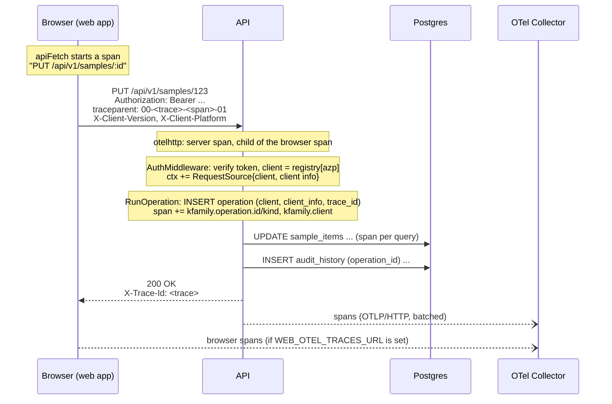

# Request tracing and change attribution

Every change to the data can be traced back to **who** made it, **from which
app**, **as part of which action**, and **which request**, down to the
individual database queries. This document explains how that works, how to
configure it, and how to extend it when new apps (mobile, admin, batch jobs)
start calling the API.

- [The four questions](#the-four-questions)
- [How a request flows](#how-a-request-flows)
- [Data model](#data-model)
- [Identifying the app (clients)](#identifying-the-app-clients)
- [Tracing (OpenTelemetry)](#tracing-opentelemetry)
- [CORS](#cors)
- [Configuration](#configuration)
- [How-to](#how-to)
- [Security and privacy](#security-and-privacy)
- [Testing](#testing)
- [Not done yet](#not-done-yet)

## The four questions

| Question | Answered by | Where it lives | Trust |
|---|---|---|---|
| Who? | the signed-in user (or a service account) | `operation.performed_by`, `audit_history.changed_by` | verified: access token |
| From which app? | the Casdoor application the token was issued to | `operation.client` (`web`, `mobile`, `admin`, `batch:<job>`, `system`) | verified: access token |
| As part of what action? | the operation | `operation.kind` (`sample.update`, `sample.import`, ...); `audit_history.operation_id` links each row change to it | set by the API code |
| Which request? | the OpenTelemetry trace id | `operation.trace_id`, the `X-Trace-Id` response header, every log line, the trace itself | correlation only |

Two kinds of storage, two lifetimes:

- **Database (permanent):** business attribution. It's small and it's kept for as long as the data is.
- **Tracing backend and logs (days to weeks):** technical detail: timings, every query, errors.

The trace id joins them. An old operation keeps its `trace_id` after the trace
itself has expired. That's expected.

## How a request flows



Step by step, with the code:

1. **Browser.** [`apiFetch`](../web/src/lib/api-client.ts) creates a client span for each API call. It sends the span's `traceparent`, plus `X-Client-Version` and `X-Client-Platform: web`. The browser starts the trace, so it also makes the sampling decision.
2. **Server span.** [`telemetry.HTTPHandler`](../api/internal/telemetry/telemetry.go) wraps the whole server. It continues the incoming trace, or starts a new one if there's no `traceparent`. The span is named after the route (`PUT /api/v1/samples/:id`), not the raw path. Only `/api/*` is traced; health checks, `/config.js` and static files aren't.
3. **Middleware.** [`telemetry.Middleware`](../api/internal/telemetry/telemetry.go) sets `X-Trace-Id` on the response, records `http.route`, and gives the request a logger tagged with `trace_id`/`span_id`.
4. **Auth.** [`AuthMiddleware`](../api/internal/middleware/auth.go) verifies the token, resolves the **client** from its `azp`/`aud` claim through the [client registry](../api/internal/util/client.go), and puts a `RequestSource` (client name plus self-reported client info) into the request context. This happens before anything can be written, so even first-sign-in user provisioning is attributed.
5. **Operation.** [`util.RunOperation`](../api/internal/util/operation.go) inserts the `operation` row with the client, client info and current trace id, and tags the current span with the operation. Every `Insert`/`UpdateByID` inside it writes `audit_history` rows that point at the operation.
6. **Database.** [`telemetry.OpenDB`](../api/internal/telemetry/telemetry.go) makes every query a child span. Only the parameterized SQL is recorded, never argument values.
7. **Export.** Spans go to the OTel Collector over OTLP/HTTP when an endpoint is configured.

**Trace ids exist even when nothing is exported or sampled.** The SDK is always installed, so every request gets a trace id that is returned, logged and stored. Configuring an exporter only decides whether the spans themselves get stored somewhere.

## Data model

All in [0001-init.sql](../api/migrations/0001-init.sql).

**`operation`**: one row per user action that writes data.

| Column | Meaning |
|---|---|
| `kind` | `"<resource>.<action>"`, e.g. `sample.create`. The web app translates it (`operation.kind.*` in `translation.json`). |
| `performed_by` | the user, or the client's service account |
| `target_table`, `target_id` | the record acted on directly. Changes to other records in the same operation are its *side effects*. NULL for e.g. imports. |
| `metadata` | free-form context set by the code, e.g. `{"fileName": "family.csv", "rows": 120}` |
| `client` | verified app name |
| `client_info` | self-reported: `version`, `platform`, `ip`, `userAgent` (hints, not proof) |
| `trace_id` | W3C trace id, 32 lower-case hex characters |

**`audit_history.operation_id`**: every row snapshot points at the operation that caused it.

**`"user".is_service`**: service accounts. They act for clients without a signed-in user, and they can never sign in interactively, by sub or by email. A seeded `system` account (`util.SystemUserID`) is used for the API's own tasks. Service accounts never count as admins for the last-admin guard.

## Identifying the app (clients)

Each app is its own **Casdoor application** with its own `client_id`. The access token says which application it was issued to (`azp`, falling back to `aud`). The API looks that up in its registry:

| App | Registered via | Grant | Acts as |
|---|---|---|---|
| Web app (`web`) | `CASDOOR_CLIENT_ID` | authorization code, exchanged server-side | the signed-in user |
| Mobile app (`mobile`) | `API_CLIENTS` | authorization code + PKCE | the signed-in user |
| Admin app (`admin`) | `API_CLIENTS` | authorization code | the signed-in user |
| Batch job (`batch:<job>`) | `API_CLIENTS` with `serviceUserId` | client credentials (with secret) | its service account |
| The API itself (`system`) | built in, via `util.SystemContext` | none | `util.SystemUserID` |

A token from an application that isn't registered gets **401**. A service client whose `serviceUserId` isn't a live service account stops the API at startup.

**Why not a header like `X-App: mobile`?** Any caller can set any header. Headers (`X-Client-Version`, `X-Client-Platform`, `User-Agent`) are stored as `client_info`, which is useful but unverified. The *client* comes only from the signed token.

## Tracing (OpenTelemetry)

### What is traced

| Span | Where | Named |
|---|---|---|
| Browser API call | `apiFetch` | `PUT /api/v1/samples/:id` (ids replaced by `:id`) |
| API request | `telemetry.HTTPHandler` | `PUT /api/v1/samples/:id` |
| SQL query | `telemetry.OpenDB` | per statement; parameterized SQL only |
| Casdoor code exchange | `telemetry.HTTPClient` in the sign-in handler | `HTTP POST` |
| API's own tasks | `util.SystemContext` | the task name |

Request spans carry `kfamily.operation.id`, `kfamily.operation.kind` and `kfamily.client` when they ran an operation. In the tracing UI you can search for e.g. `kfamily.client=mobile`.

The web app instruments `apiFetch` itself, rather than using OTel's `fetch` auto-instrumentation. The browser also calls Casdoor directly (token refresh), and auto-instrumentation would add trace headers to those calls and fail Casdoor's CORS preflight.

### Propagation and sampling

- W3C Trace Context (`traceparent`, `tracestate`) and Baggage, both ways.
- **The API is parent-based.** It follows the sampling flag of an incoming `traceparent`, and samples everything it starts itself. You can override this with `OTEL_TRACES_SAMPLER` / `OTEL_TRACES_SAMPLER_ARG`, e.g. `parentbased_traceidratio` + `0.25`.
- **The browser samples `WEB_OTEL_SAMPLE_RATIO` of the traces it starts** (default `1`), and the API follows that decision for those requests.

### Logs

Every request's log lines (Echo's `c.Logger()`, including the request log) carry `trace_id` and `span_id`. Logs still go to stdout, so collect them as usual (Docker/Loki) and search by `trace_id`.

### The trace id in the UI

- **Error messages.** When an API call fails, the web app shows **"Reference: \<trace id\>"**: in form errors (`MutationFeedback`), in failed-load messages (`QueryBoundary`) and in delete toasts. Users can quote it.
- **Operation detail page.** It shows the source app, client info and trace id. With `TRACE_URL_TEMPLATE` set, the trace id links to the tracing UI.

### From a reference to everything

Given a trace id from a user's report:

```sql
-- what it changed
SELECT o.kind, o.client, o.created_at, a.table_name, a.source_id, a.action
FROM operation o JOIN audit_history a ON a.operation_id = o.id
WHERE o.trace_id = '4bf92f3577b34da6a3ce929d0e0e4736';
```

Then open the trace in the tracing UI and search the logs for `trace_id=<id>`. In the other direction, the Operations page links each operation to its trace.

## CORS

CORS only matters for **browser** apps on **another origin**:

| Caller | Needs CORS? |
|---|---|
| Web app (served by the API, proxied by Vite in dev) | no, same origin |
| Admin app on its own domain | **yes**: add its origin to `CORS_ALLOWED_ORIGINS` |
| Native mobile app, batch job, server-to-server | no, they're not browsers |

`CORS_ALLOWED_ORIGINS` is an explicit list (`scheme://host[:port]`, comma-separated, no `*`), validated at startup. For those origins the API ([corsConfig](../api/cmd/api/main.go)):

- allows `GET`, `POST`, `PUT`, `DELETE`;
- allows the headers `Authorization`, `Content-Type`, `Accept`, `traceparent`, `tracestate`, `baggage`, `X-Client-Version` and `X-Client-Platform`;
- exposes `X-Trace-Id`, so the other app can read it;
- keeps credentials off, since auth is a Bearer token, not a cookie;
- caches preflights for 2 hours.

There's a second CORS setting, at the **collector**. When the browser exports its own spans (`WEB_OTEL_TRACES_URL`), the collector's OTLP/HTTP receiver must allow the web app's origin; see [otel-collector.yaml](../deploy/otel/otel-collector.yaml). The API also adds that collector's origin to its Content-Security-Policy `connect-src`.

## Configuration

All on the API ([.env-sample](../api/.env-sample)). The web app gets its settings from `/config.js`.

| Variable | Default | Purpose |
|---|---|---|
| `CASDOOR_CLIENT_ID` | (required) | the web app's Casdoor application, registered as client `web` |
| `API_CLIENTS` | none | JSON array of other apps: `[{"name":"mobile","clientId":"..."},{"name":"batch:nightly-sync","clientId":"...","serviceUserId":"..."}]`. Names are `a-z 0-9 : _ -`, `system` is reserved. |
| `CORS_ALLOWED_ORIGINS` | none | other browser apps' origins |
| `OTEL_EXPORTER_OTLP_ENDPOINT` | none (export off) | collector's OTLP/HTTP base URL, e.g. `http://otel-collector:4318`. All standard `OTEL_*` variables work (`_HEADERS`, `_TRACES_ENDPOINT`, `OTEL_SERVICE_NAME`, `OTEL_RESOURCE_ATTRIBUTES`, `OTEL_TRACES_SAMPLER[_ARG]`). `OTEL_SDK_DISABLED=true` turns export off. |
| `WEB_OTEL_TRACES_URL` | none | where the **browser** exports its spans, e.g. `https://otel.example.com/v1/traces`. Must be reachable from users' browsers and allow the app's origin. Empty means the browser still propagates traces but doesn't export its own spans. |
| `WEB_OTEL_SAMPLE_RATIO` | `1` | share of browser-started traces to sample, 0-1 |
| `TRACE_URL_TEMPLATE` | none | e.g. `https://jaeger.example.com/trace/{traceId}`, used for links on the operation page |

The API reports itself as `service.name=kfamily-api` and the browser as `kfamily-web`, with the build version and `deployment.environment.name` = `ENV`.

## How-to

### See traces locally

```bash
cd deploy/otel && docker compose up -d     # collector on :4317/:4318, Jaeger UI on :16686
```

In `api/.env`:

```bash
OTEL_EXPORTER_OTLP_ENDPOINT=http://localhost:4318
WEB_OTEL_TRACES_URL=http://localhost:4318/v1/traces
TRACE_URL_TEMPLATE=http://localhost:16686/trace/{traceId}
```

Restart the API, use the app, and open http://localhost:16686. A trace starts in `kfamily-web` and continues into `kfamily-api` and its queries.

### Add the mobile app

1. In Casdoor, create an application for it (authorization code + PKCE), with the app's redirect URI.
2. Register it: `API_CLIENTS=[{"name":"mobile","clientId":"<its client id>"}]`.
3. In the app, send on every API call:
   - `Authorization: Bearer <token>`
   - `traceparent`, from the OpenTelemetry SDK for its platform, so traces join
   - `X-Client-Version: <app version>` and `X-Client-Platform: ios|android`

   Show the `X-Trace-Id` of failed calls as an error reference.
4. No CORS entry: a native app isn't a browser.

The API needs no code changes. Every operation from the app is recorded with `client = "mobile"`.

### Add a browser app on another origin (e.g. admin)

Same as the mobile app (with `"name":"admin"`), plus add its origin to `CORS_ALLOWED_ORIGINS`. If it exports its own spans, also allow its origin on the collector.

### Add a batch job

1. Create its service account. There's no UI for it yet, so use SQL:
   ```sql
   INSERT INTO "user" (id, sub, email, name, is_admin, is_service, created_at, created_by)
   VALUES (gen_random_uuid(), 'service:nightly-sync', 'nightly-sync@kfamily.internal',
           'Nightly sync', FALSE, TRUE, now(), '00000000-0000-0000-0000-000000000001');
   ```
   Set `is_admin` only if the job must call admin-only endpoints.
2. In Casdoor, create an application with the client-credentials grant, and give the job its client id and secret.
3. Register it: `{"name":"batch:nightly-sync","clientId":"...","serviceUserId":"<id from step 1>"}`.
4. The job starts a root span per run and sends `traceparent` with its calls.

Its operations are recorded with `client = "batch:nightly-sync"` and `performed_by` = its service account. Deleting the service account locks the client out.

> Casdoor's client-credentials tokens haven't been tested against this API yet; check the token's `azp`/`aud` claims when adding the first job.

### Record a multi-row action (e.g. an import)

One `RunOperation` per user action. Pass its `ctx`/`tx` to every write:

```go
op := util.Operation{
    Kind:        "sample.import",
    PerformedBy: userID,
    Metadata:    map[string]any{"fileName": name, "rows": len(rows)},
} // no TargetTable: an import has no single target
err := util.RunOperation(ctx, s.db, op, func(ctx context.Context, tx *sqlx.Tx) error {
    for _, r := range rows {
        if err := util.Insert(ctx, tx, tableName, r.ID, r.params()); err != nil {
            return err
        }
    }
    return nil
})
```

Then add `operation.kind.sample.import` to `translation.json`. Each imported row's history will say "Part of Import samples". For a button that updates its target and a second table, set `TargetTable`/`TargetID`; the other table's rows then show "Side effect of ...".

### Run work inside the API (scheduled or startup tasks)

```go
ctx, span := util.SystemContext(ctx, "cleanup-expired-invites")
defer span.End()
err := util.RunOperation(ctx, db, util.Operation{Kind: "invite.expire", PerformedBy: util.SystemUserID}, ...)
```

The task gets its own trace and `client = "system"`. `RunOperation` refuses to run without a request source, so a write can't be left unattributed.

## Security and privacy

- **Verified vs reported.** `client` and `performed_by` come from the signed token. `client_info` and the `traceparent` header come from the caller, so treat them as hints.
- **Public clients can't fully prove themselves.** A user can copy their own mobile token and call the API with curl; it would still show as `mobile`, but as that real user. Confidential clients (batch jobs, which hold a secret) are provable. The web app exchanges its code server-side with the secret.
- **Incoming trace context is trusted for correlation.** A caller can pick its trace id and force sampling with the sampled flag. That's fine for our own apps. If the API becomes public, limit volume at the collector (tail sampling, rate limits), or treat incoming context as a link (`otelhttp.WithPublicEndpointFn`).
- **Personal data.** `client_info.ip` and `userAgent` are stored permanently with each operation, and HTTP spans record the client address. Cover this in the privacy notice, and decide on retention. Scrub span attributes at the collector if needed; there's an example in [otel-collector.yaml](../deploy/otel/otel-collector.yaml). Query argument values are never recorded on spans.
- **A public collector endpoint** (for browser export) can receive junk from anyone. Put it behind a rate-limiting proxy, or drop browser export (leave `WEB_OTEL_TRACES_URL` empty); traces still start in the browser and continue in the API.

## Testing

- **Unit tests** (`go test ./...`):
  - client registry parsing and lookup
  - origin and config validation
  - token-to-client resolution (`validateClaims`)
  - `RunOperation` guards (no source, no kind, nesting)
  - route-named spans, `X-Trace-Id` and continuing a caller's trace (`telemetry`)
  - CORS preflight, allowed headers and exposed headers (`cmd/api`)
- **End to end:** verified once, with a throwaway program not committed, against Postgres 18. It covered:
  - first sign-in
  - web, mobile and batch tokens
  - unregistered apps
  - service-account takeover attempts
  - trace-id propagation into operations and spans
  - DB spans
  - search by client
  - audit history
  - system tasks
  - `/config.js`
  - OTLP/HTTP export

## Not done yet

- **Logs over OTLP.** Logs go to stdout with `trace_id`. Routing `slog` through the OTel log bridge would send them to the collector too.
- **Metrics.** None are exported.
- **Queued jobs.** There's no job queue yet. When there is, carry the enqueuing request's trace context in the job payload, start the worker's span with a *link* to it, and put `initiatedBy` in the operation's `metadata`.
- **Per-client permissions.** E.g. only `admin` may delete users. The registry already knows the client; a route middleware would enforce it.
- **Client filter.** The Operations page has no dedicated filter; search by the client key (e.g. `mobile`), or sort by the Source column.
- **Service accounts in the UI.** They can only be created with SQL for now.
